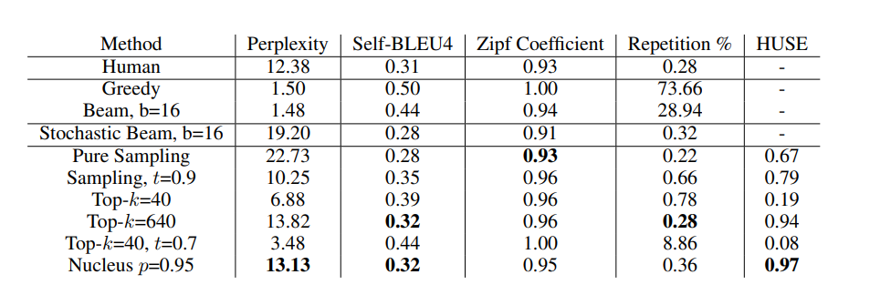
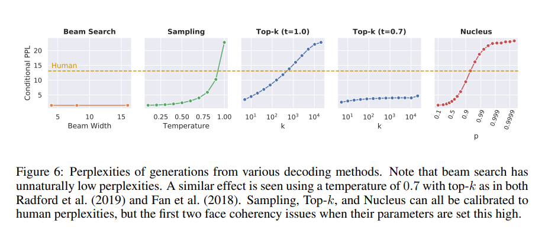
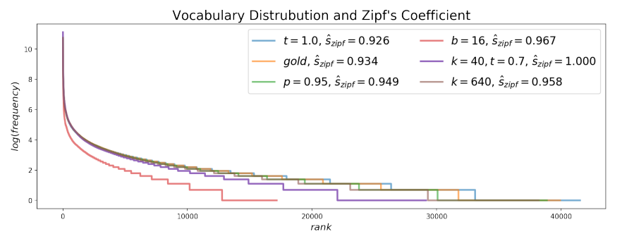
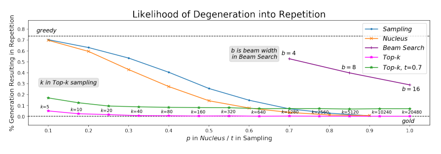

# LLMS Neural Text Degeneration

Reproducing Results from the Paper: "The Curious Case of Neural Text Degeneration". This is done for my LLMs class, I'll update the changes soon!
*** 

This paper explores the problem of neural text degeneration in language models. While these models can produce fluent text at first, they often suffer from issues like vocabulary distribution imbalances, repetition, and a gradual loss of coherence, leading to nonsensical or degraded outputs. To address this we propose Nucleus Sampling, a simple but effective method to draw considerably higher quality text out of neural language models than previous decoding strategies. Our approach avoids text degeneration by truncating the unreliable tail of the probability distribution, sampling from the dynamic nucleus of tokens containing the vast majority of the probability mass.

## Main Results

 Main results for comparing all decoding methods with selected parameters of each method. The numbers closest to human scores are in bold except for HUSE (Hashimoto et al., 2019), a combined human and statistical evaluation, where the highest (best) value is bolded. For Top-k and Nucleus Sampling, HUSE is computed with interpolation rather than truncation

## Perplexities

Perplexities of generations from various decoding methods. Note that beam search has unnaturally low perplexities. A similar effect is seen using a temperature of 0.7 with top-k as in both Radford et al. (2019) and Fan et al. (2018). Sampling, Top-k, and Nucleus can all be calibrated to human perplexities, but the first two face coherency issues when their parameters are set this high.

## Vocabulary Distribution and Zipf's Law

A rank-frequency plot of the distributional differences between n-gram frequencies of human and machine text. Sampling and Nucleus Sampling are by far the closest to the human distribution, while Beam Search clearly follows a very different distribution than natural language.

## Self-BLEU of Generations

Self-BLEU calculated on the unconditional generations produced by stochastic decoding methods; lower Self-BLEU scores imply higher diversity. Horizontal blue and orange lines represent human self-BLEU scores. Note how common values of t ∈ [0.5, 1] and k ∈ [1, 100] result in high self-similarity, whereas “normal” values of p ∈ [0.9, 1) closely match the human distribution of text.

## Likelihood of Degeneration into Repetition

We visualize how often different decoding methods get “stuck” in loops within the first 200 tokens. A phrase (minimum length 2) is considered a repetition when it repeats at least three times at the end of the generation. We label points with their parameter values except for t and p which follow the x-axis. Values of k greater than 100 are rarely used in practice and values of p are usually in [0.9, 1); therefore Nucleus Sampling is far closer to the human distribution in its usual parameter range. Sampling with temperatures lower than 0.9 severely increase repetition. Finally, although beam search becomes less repetitive according to this metric as beam width increases, this is largely because average length gets shorter as b increases
