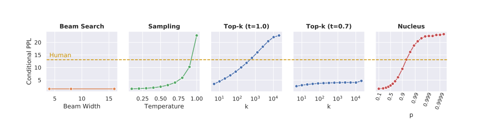
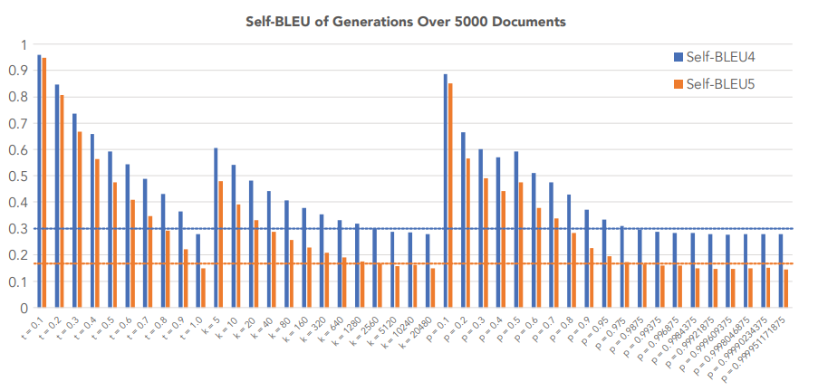

# LLMS Neural Text Degeneration

Reproducing Results from the Paper: "The Curious Case of Neural Text Degeneration". This is done for my LLMs class, I'll update the changes soon!

## Main Results

 Main results for comparing all decoding methods with selected parameters of each method. The numbers closest to human scores are in bold except for HUSE (Hashimoto et al., 2019), a combined human and statistical evaluation, where the highest (best) value is bolded. For Top-k and Nucleus Sampling, HUSE is computed with interpolation rather than truncation

## Perplexities

Perplexities of generations from various decoding methods. Note that beam search has unnaturally low perplexities. A similar effect is seen using a temperature of 0.7 with top-k as in both Radford et al. (2019) and Fan et al. (2018). Sampling, Top-k, and Nucleus can all be calibrated to human perplexities, but the first two face coherency issues when their parameters are set this high.

## Vocabulary Distribution and Zipf's Law

A rank-frequency plot of the distributional differences between n-gram frequencies of human and machine text. Sampling and Nucleus Sampling are by far the closest to the human distribution, while Beam Search clearly follows a very different distribution than natural language.

## Self-BLEU of Generations

Self-BLEU calculated on the unconditional generations produced by stochastic decoding methods; lower Self-BLEU scores imply higher diversity. Horizontal blue and orange lines represent human self-BLEU scores. Note how common values of t ∈ [0.5, 1] and k ∈ [1, 100] result in high self-similarity, whereas “normal” values of p ∈ [0.9, 1) closely match the human distribution of text.

## Likelihood of Degeneration into Repetition
